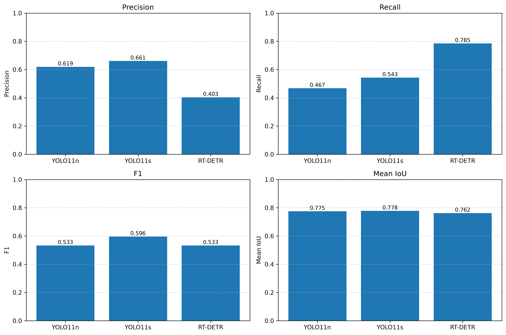
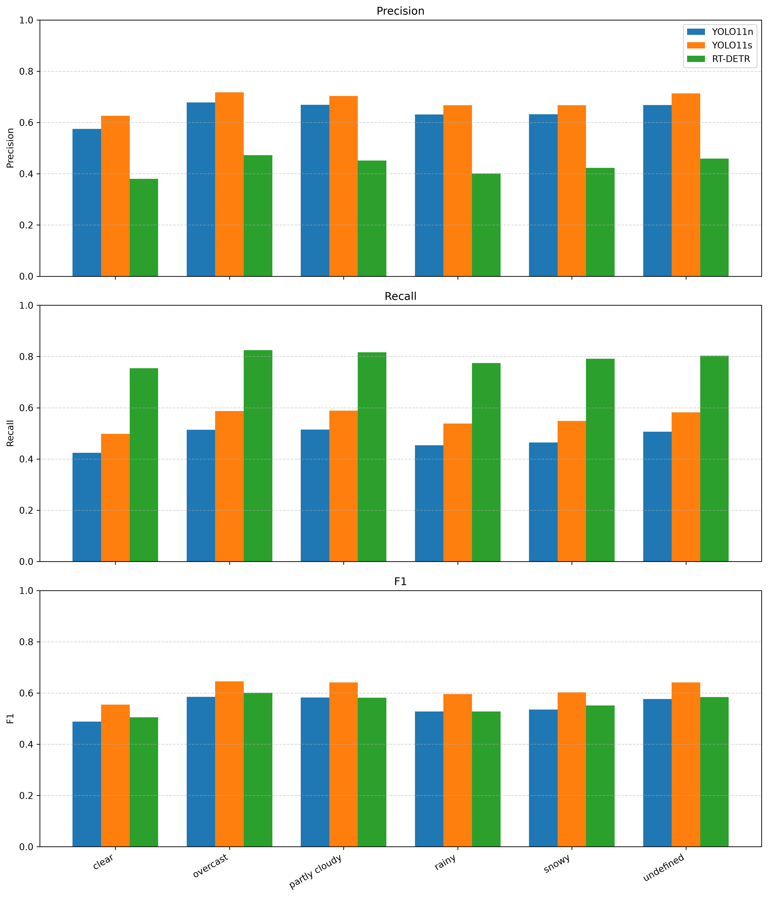
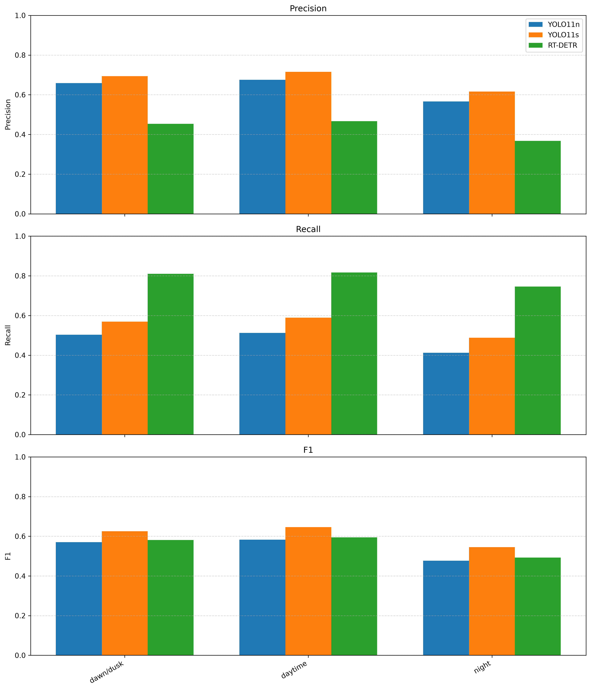
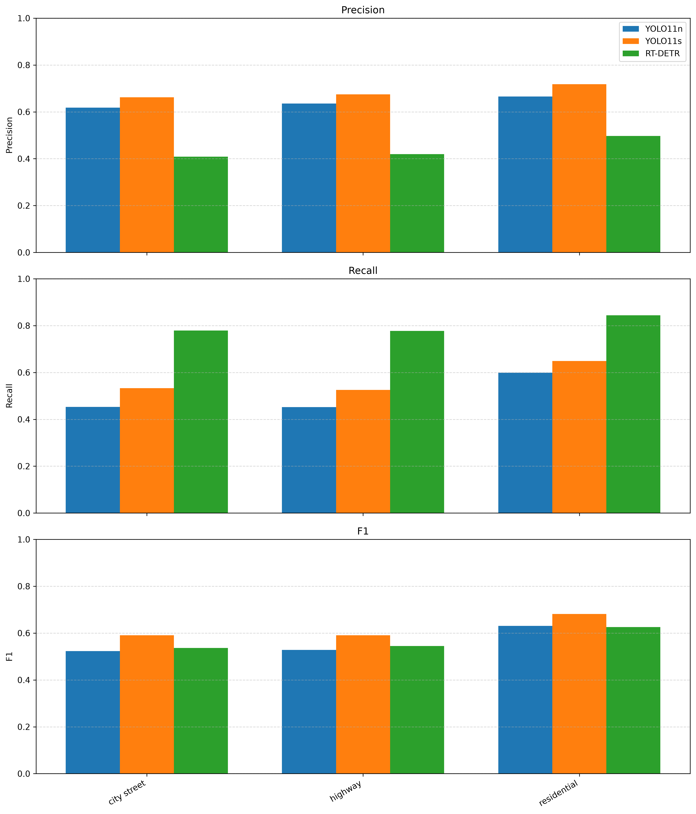

# BDD100K Object Detection Benchmark

Benchmarking **YOLO11** and **RT-DETR** for object detection on the **BDD100K** dataset with robustness evaluation across different weather, lighting, and road scene conditions.

---

## Overview

This project implements a complete pipeline for training, inference, and evaluation of modern object detection models on the BDD100K dataset. Unlike standard BDD100K benchmarks, the models are trained only on clear daytime images and evaluated on a dedicated test set containing diverse weather, lighting, and road scene conditions to assess their robustness.

The main objective is to compare the performance of different object detectors under varying environmental conditions, including:

- ☀️ Weather (clear, rainy, snowy, overcast, etc.)
- 🌙 Time of day (daytime, night, dawn/dusk)
- 🛣️ Road scene (city street, highway, residential, etc.)

---

## Motivation

Object detectors are typically evaluated on overall benchmark metrics. However, real-world driving environments vary significantly in weather, illumination, and scene complexity.

This project investigates how detector performance changes under different environmental conditions using the BDD100K dataset. The goal is to provide a more comprehensive assessment of model robustness beyond standard validation metrics.

---

The project includes:

- Dataset preparation
- Train/validation/test split generation
- Conversion to YOLO format
- Model training
- Prediction generation
- Detailed evaluation by environmental conditions

---

## Models

Currently supported models:

- YOLO11n 
- YOLO11s 
- RT-DETR 

---

## Dataset

This project uses the **BDD100K** object detection dataset.
Only the object detection task is used. The benchmark focuses on four object categories:

- Car
- Pedestrian
- Traffic Light
- Traffic Sign

### Dataset Split

Unlike the standard BDD100K split, this project creates a custom train/validation/test partition to evaluate model robustness under different environmental conditions.

#### Training Set

The training set contains **only clear daytime images**.

This allows the models to learn under ideal driving conditions without exposure to adverse weather or low-light environments.

#### Validation Set

The validation set also contains **only clear daytime images** and is used during training for model selection and monitoring.

#### Test Set

The test set contains **all remaining environmental conditions**, including:

**Weather**
- Rainy
- Snowy
- Overcast
- Partly cloudy
- Foggy
- Undefined weather
- Remaining clear images not used for training

**Time of day**
- Night
- Dawn/Dusk
- Remaining daytime images

**Road scene**
- City street
- Highway
- Residential
- Parking lot
- Tunnel
- Gas station

A fixed test set of **5,000 images** is used for all experiments.

### Motivation

The purpose of this split is to evaluate how well object detection models trained under ideal conditions generalize to unseen environmental conditions.

Instead of measuring only overall detection accuracy, the evaluation reports performance separately for:

- Weather conditions
- Time of day
- Road scene

This enables a detailed robustness analysis and allows direct comparison of model performance under different driving environments.

---

## Installation

Clone the repository

```bash
git clone https://github.com/zbalgabekova/bdd100k-object-detection-benchmark.git

cd bdd100k-object-detection-benchmark
```

Install dependencies

```bash
pip install -r requirements.txt
```

---

## Pipeline

### 1. Compute dataset statistics, generate metadata, and produce distribution plots

```bash
python scripts/prepare_dataset.py
```

### 2. Create dataset splits

```bash
python scripts/create_splits.py --metadata outputs/metadata.csv --output splits --weather clear --timeofday daytime
```

### 3. Convert dataset to YOLO format

```bash
python scripts/convert_to_yolo.py --train_csv splits/split_train.csv --val_csv splits/split_val.csv --test_csv splits/split_test.csv --labels det_v2_train_release.json --images bdd100k/bdd100k/images/100k/train
```

### 4. Verify dataset

```bash
python scripts/verify_yolo_dataset.py --dataset dataset
```

### 5. Train model

```bash
python scripts/train.py --config configs/baseline.yaml
```

### 6. Generate predictions

```bash
python scripts/predict.py --config configs/predict.yaml
```

### 7. Create ground truth for evaluation

```bash
python scripts/create_test_ground_truth.py --annotations det_v2_train_release.json --test_csv splits/split_test.csv --output data/test_ground_truth.csv
```

### 8. Evaluate model

```bash
python scripts/evaluate.py --config configs/evaluate.yaml
```

### 9. Compare models

```bash
python scripts/compare_models.py
```

---

## Evaluation

The evaluation pipeline computes:

- True Positives
- False Positives
- False Negatives
- Precision
- Recall
- F1-score
- Mean IoU

Additionally, performance is reported separately for:

- Weather
- Time of day
- Road scene

---

## Results

The benchmark compares the performance of three object detection models trained on clear daytime images and evaluated on a test set containing diverse weather, lighting, and scene conditions.

### Overall Performance

| Model | Precision | Recall | F1 | Mean IoU |
|--------|----------:|-------:|---:|---------:|
| YOLO11n |0.6194|0.4675|0.5328 |0.7752 |
| YOLO11s |**0.6606** |0.5430 |**0.5960** |**0.7779** |
| RT-DETR |0.4031 |**0.7850** |0.5327 |0.7624 |

> **Best values are shown in bold.**

YOLO11s achieved the best overall balance between Precision and Recall, resulting in the highest F1-score and Mean IoU. RT-DETR obtained the highest Recall but generated substantially more false positives, leading to lower Precision.

<p align="center">
  
</p>

---

### Performance under Different Weather Conditions

The models generalized well across different weather conditions. Performance differences between clear, rainy, snowy, and overcast scenes were relatively small.

<p align="center">
  
</p>


### Performance under Different Lighting Conditions

Lighting conditions had a much stronger impact than weather. All models experienced a noticeable decrease in performance during night-time scenes, demonstrating that illumination is a more challenging factor for object detection than weather.

<p align="center">
  
</p>


### Performance in Different Road Scenes

The benchmark also evaluated performance across different road environments, including city streets, highways, and residential areas. The differences were smaller than those caused by lighting conditions.

<p align="center">
  
</p>


### Key Findings

- **YOLO11s** achieved the best overall performance, obtaining the highest Precision, F1-score, and Mean IoU.
- **RT-DETR** achieved the highest Recall by detecting significantly more objects, but produced many more false positives.
- **Night-time** scenes were considerably more challenging than daytime scenes for all models.
- **Weather conditions** had only a moderate influence on performance compared with lighting conditions.
- Increasing model capacity from **YOLO11n** to **YOLO11s** consistently improved detection performance.

---

## Configuration

All scripts use YAML configuration files stored in:

```
configs/
```

Examples:

- baseline.yaml
- predict.yaml
- evaluate.yaml

---

## Future Work

Several directions can further improve and extend this benchmark:

- **Train on all weather and lighting conditions.** Compare model performance when trained on the complete BDD100K dataset instead of only clear daytime images.

- **Evaluate additional object detectors.** Extend the benchmark by including recent models such as YOLOv12, YOLOv13 (when available), YOLO-NAS, D-FINE, or other state-of-the-art real-time detectors.

- **Perform hyperparameter optimization.** Investigate the influence of image size, confidence threshold, IoU threshold, batch size, and training epochs on detection performance.

- **Evaluate computational efficiency.** Compare inference speed (FPS), GPU memory consumption, model size, and training time in addition to detection accuracy.

- **Analyze performance on individual object classes.** Conduct a more detailed study of challenging classes such as pedestrians, traffic lights, and traffic signs under different environmental conditions.

- **Extend the evaluation metrics.** Include mAP@0.5, mAP@0.5:0.95, precision-recall curves, confusion matrices, and calibration analysis for a more comprehensive comparison.

- **Investigate domain adaptation.** Study how models trained on daytime images can be adapted to night-time or adverse weather conditions using fine-tuning or domain adaptation techniques.

- **Benchmark on additional datasets.** Validate the findings on other autonomous driving datasets such as Cityscapes, KITTI, Mapillary Vistas, or nuScenes to evaluate model generalization.

- **Develop an automated benchmarking framework.** Package the training, evaluation, and comparison scripts into a reproducible pipeline that allows researchers to benchmark new object detection models with minimal configuration.

---

## License

This project is released under the MIT License.

---

## Acknowledgements

- BDD100K dataset
- Ultralytics

